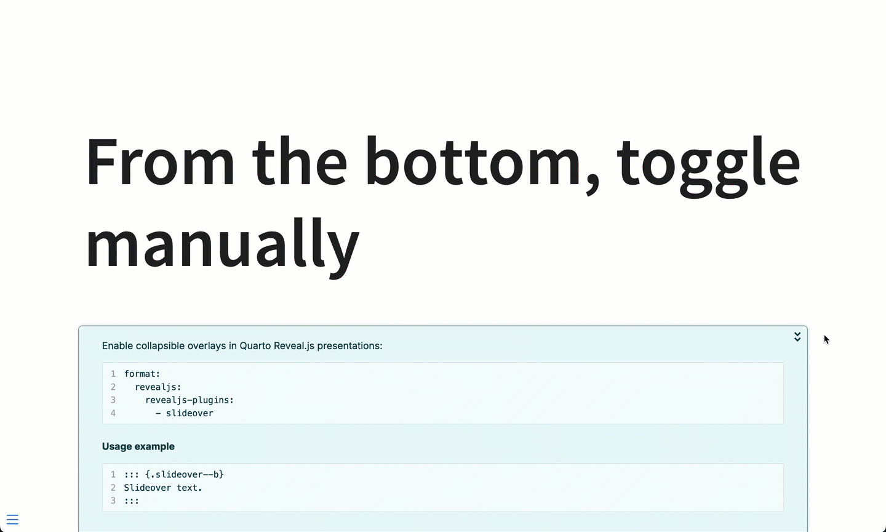

# Slideover Extension for Quarto Revealjs Presentations

This extension provides collapsible content overlays that slide over the existing slide. It was originally created to overlay instructional content on Jupyter Notebooks and web apps. The extension offers a cleaner alternative to static CSS modals, which often interfere with the underlying content.



## Demo

Try the [live demo](https://nrichers.github.io/slideover/) to see slideover in action.

## Features

- Works with [Quarto Revealjs presentations](https://quarto.org/docs/presentations/revealjs/)
- Slides over the presentation from the right or bottom
- Optional auto-collapse after 5 seconds
- Mobile responsive

## Installation

Install the extension with:

```bash
quarto add nrichers/slideover
```

## Usage

To enable, add the extension to your YAML front matter:

```yaml
format:
  revealjs:
    revealjs-plugins: 
      - slideover
```

For bottom slide-overs, use `.slideover--b`:

```md
::: {.slideover--b}
This is an example that slides content over from the bottom.
:::
```

For auto-collapsing slide-overs, add the `.auto-collapse` class:

```md
::: {.slideover--b .auto-collapse}
This is an example that slides content over from the bottom and then auto-collapses after five seconds.
:::
```

```md
::: {.slideover--r}
This is an example that slides content over from the right.
:::
```

## Tips & Tricks

- Slideover provides basic styling support for **bold** and _italic_ text
- For advanced styling, use [Tachyons Extension For Quarto](https://github.com/nareal/tachyons)
- Headings are NOT supported inside slideovers due to Quarto and Pandoc limitations

## License

MIT licensed. Copyright (C) 2025 Nik Richers.
